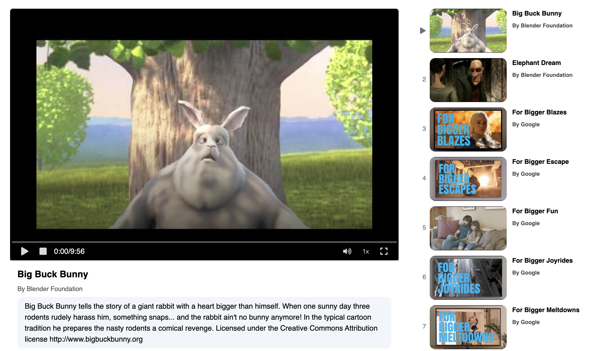

# Rigi Video Player

## Introduction
Rigi Video Player is a versatile web application that offers seamless playback of videos with a variety of features to enhance the viewing experience. Whether you're watching a single video or managing an entire playlist, Rigi Video Player provides the tools you need for smooth playback and control.

## Features

1. **VideoPlayer component**
  - Play Pause
  - seeking using seeking bar
  - current timer displaying
  - autoplay next video in the playlist
  - speed selector to change playback speed
  - fullscreen mode
  - volume control with mute button
  - stop video 

2. **PlayList component**
  - show all video the thumbnail and title in playlist
  - reorder playlist
  - click on any video from playlist

To Open the Player use this Link [VideoPlayer](https://showtime-player.netlify.app/)

## Dependencies
- Vite
- React.js
- Tailwind CSS

## Getting Started
This project uses Vite + React.js
1. Clone the repository:
   ``git clone https://github.com/ajb-arvind/rigi-video-player.git``
2. To run the project locally, follow these steps:
  - navigate to project folder ``cd rigi-video-player``
  - Install dependencies using ``npm install``.
  - Run the project using ``npm run dev``
  - Use Localserver id ``http://localhost:5173/``

